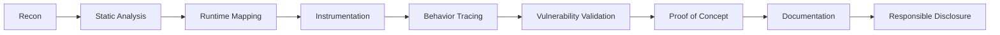

<p align="center">
  
</p>

<p align="center">
  
</p>

<p align="center">
  <a href="https://github.com/missaels235">
    
  </a>
  
  
  
</p>

<p align="center">
  <strong>
    <code>OFFENSIVE RESEARCH</code>
    &nbsp;•&nbsp;
    <code>DYNAMIC INSTRUMENTATION</code>
    &nbsp;•&nbsp;
    <code>MOBILE EXPLOITATION</code>
  </strong>
</p>

---

<!-- ===================== IDENTITY ====================== -->

## `root@missael:~# whoami`

```text
┌──[ OPERATOR PROFILE ]
│
├─ Alias       : Missael
├─ Role        : Mobile Security Researcher
├─ Specialty   : iOS Security & Reverse Engineering
├─ Arsenal     : Frida · Python · JavaScript · LLDB
├─ Environment : Jailbroken iOS · Linux · macOS
├─ Location    : Mexico
├─ Objective   : Understand systems at runtime
└─ Status      : ACTIVE
```

I am a **Mobile Security Researcher and Reverse Engineer** focused on dissecting the internal behavior of iOS applications, runtime security controls and jailbreak environments.

I develop specialized tooling for **dynamic instrumentation, application analysis, network inspection and vulnerability validation** using technologies such as Frida, Python, JavaScript and LLDB.

My research is centered on understanding how modern mobile applications behave beneath the user interface—where trust boundaries, entitlement systems, runtime protections and security assumptions can be observed and evaluated.

<p align="center">
  
</p>

> **I do not trust the interface. I inspect the runtime.**

---

<!-- ==================== ATTACK SURFACE ==================== -->

## ⚔️ Attack Surface

<p align="center">
  
  
  
  
</p>

<p align="center">
  
  
  
  
</p>

<table>
  <tr>
    <td width="50%" valign="top">

### `01 // iOS Internals`

* Objective-C runtime inspection
* Application lifecycle analysis
* Entitlements and sandbox behavior
* Keychain and local-storage research
* Jailbreak environment analysis
* Runtime method interception

    </td>
    <td width="50%" valign="top">

### `02 // Application Security`

* Authentication-flow assessment
* Client-side trust analysis
* API and network inspection
* Certificate-pinning research
* Anti-debugging identification
* Anti-tampering evaluation

    </td>
  </tr>
  <tr>
    <td width="50%" valign="top">

### `03 // Dynamic Instrumentation`

* Frida agents and utilities
* Runtime class enumeration
* Method tracing and hooking
* Native and Objective-C analysis
* Behavioral logging
* Security-control validation

    </td>
    <td width="50%" valign="top">

### `04 // Vulnerability Research`

* Attack-surface mapping
* Root-cause investigation
* Controlled exploitation
* Proof-of-concept development
* Technical documentation
* Responsible disclosure

    </td>
  </tr>

</table>

---

<!-- ==================== TECH ARSENAL ==================== -->

## ☠️ Technical Arsenal

### `Languages`

<p align="center">
  
</p>

### `Infrastructure and Development`

<p align="center">
  
</p>

### `Security Toolchain`

<p align="center">
  
  
  
  
  
</p>

<p align="center">
  
  
  
  
  
</p>

---

<!-- ==================== ACTIVE OPERATIONS ==================== -->

## 🚨 Active Operations

<table>
  <tr>
    <td width="50%" valign="top">
      <h3>🔓 FilzaForge</h3>
      <p>
        Security-oriented toolkit for controlled file-system exploration,
        inspection and analysis on jailbroken iOS devices.
      </p>
      <p>
        
        
        
      </p>
    </td>
    <td width="50%" valign="top">
      <h3>🍎 Frida iOS IAP Toolkit</h3>
      <p>
        Runtime instrumentation toolkit for authorized inspection of
        StoreKit behavior, transaction flows and entitlement validation.
      </p>
      <p>
        
        
        
      </p>
    </td>
  </tr>

  <tr>
    <td width="50%" valign="top">
      <h3>🌐 StoreKit Network Enhancer</h3>
      <p>
        Instrumentation utilities designed to expose, trace and document
        StoreKit-related network activity during authorized assessments.
      </p>
      <p>
        
        
      </p>
    </td>
    <td width="50%" valign="top">
      <h3>🔐 iOS SSL Monitor</h3>
      <p>
        Research utility for observing certificate validation, locating
        pinning logic and evaluating mobile network-security controls.
      </p>
      <p>
        
        
      </p>
    </td>
  </tr>
</table>

<p align="center">
  <a href="https://github.com/missaels235?tab=repositories">
    
  </a>
</p>

---

<!-- ==================== CVE RESEARCH ==================== -->

## 🧬 Vulnerability Research

```text
[+] Mapping attack surface
[+] Reproducing abnormal behavior
[+] Isolating vulnerable components
[+] Identifying root cause
[+] Developing controlled proof of concept
[+] Documenting technical impact
[+] Preparing responsible disclosure
```

| Target           | Research Type             | Language |    Status    |
| :--------------- | :------------------------ | :------: | :----------: |
| `CVE-2025-24104` | Reproducible security PoC |  Python  | `DOCUMENTED` |
| `CVE-2024-44258` | Reproducible security PoC |  Python  | `DOCUMENTED` |

<p align="center">
  
</p>

---

<!-- ==================== KILL CHAIN ==================== -->

## ⛓️ Research Kill Chain



```text
TARGET
  │
  ├──► Reconnaissance
  │
  ├──► Binary and runtime analysis
  │
  ├──► Security-control identification
  │
  ├──► Controlled validation
  │
  ├──► Root-cause documentation
  │
  └──► Defensive remediation guidance
```

---

<!-- ==================== LIVE TELEMETRY ==================== -->

## 📡 Live Telemetry

<p align="center">
  
  
</p>

<p align="center">
  
</p>

<p align="center">
  
</p>

---

<!-- ==================== ACTIVITY GRAPH ==================== -->

## 📈 Operation Timeline

<p align="center">
  
</p>

---

<!-- ==================== CONTRIBUTION SNAKE ==================== -->

## 🐍 Contribution Breach

<p align="center">
  <picture>
    <source
      media="(prefers-color-scheme: dark)"
      srcset="https://raw.githubusercontent.com/missaels235/missaels235/output/github-contribution-grid-snake-dark.svg"
    />
    <source
      media="(prefers-color-scheme: light)"
      srcset="https://raw.githubusercontent.com/missaels235/missaels235/output/github-contribution-grid-snake.svg"
    />
    
  </picture>
</p>

<!--
The contribution snake requires a GitHub Actions workflow
that generates the SVG files in the "output" branch.
-->

---

<!-- ==================== PROFILE SUMMARY ==================== -->

## 🛰️ Intelligence Summary

<p align="center">
  
</p>

<p align="center">
  
  
</p>

---

<!-- ==================== ETHICS ==================== -->

## 🛡️ Rules of Engagement

> All repositories, proof-of-concept projects and technical demonstrations published through this profile are intended exclusively for legitimate research, education and defensive security.

```text
AUTHORIZED TARGETS ONLY
CONTROLLED ENVIRONMENTS ONLY
RESPONSIBLE DISCLOSURE ALWAYS
```

Testing must only be performed against systems, devices and applications that you own or have explicit authorization to assess.

The objective of this research is to improve technical understanding, expose weak security assumptions and contribute to stronger defensive engineering.

I do not support unauthorized access, data theft, service disruption or malicious use of the techniques documented in my repositories.

---

<!-- ==================== COLLABORATION ==================== -->

## 🤝 Establish a Secure Channel

I am open to collaborating on:

* iOS security research
* Frida agent and toolkit development
* Mobile reverse engineering
* Jailbreak environment analysis
* Runtime instrumentation
* Network-security evaluation
* Vulnerability reproduction
* Defensive security automation
* Responsible proof-of-concept development

<p align="center">
  <a href="https://github.com/missaels235">
    
  </a>
  <a href="https://github.com/missaels235?tab=repositories">
    
  </a>
</p>

---

<!-- ==================== FINAL MESSAGE ==================== -->

<p align="center">
  
</p>

<p align="center">
  <code>root@missael:~# research --target ios --mode authorized</code>
</p>

<p align="center">
  <strong>⚠ SYSTEM STATUS: RESEARCH IN PROGRESS ⚠</strong>
</p>

<!-- ======================== FOOTER ======================== -->

<p align="center">
  
</p>
