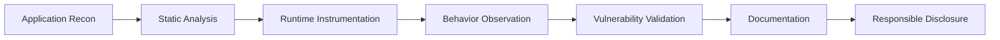

<!-- =========================================================
     MISSAEL — GITHUB PROFILE README
     Mobile Security · iOS Research · Reverse Engineering
========================================================== -->

<!-- HERO -->

<p align="center">
  
</p>

<p align="center">
  
</p>

<p align="center">
  <a href="https://github.com/missaels235">
    
  </a>
  
  
</p>

---

## `> whoami`

```text
Name       : Missael
Role       : Mobile Security Researcher
Specialty  : iOS Security, Frida Tooling & Reverse Engineering
Location   : Mexico
Mindset    : Break it. Understand it. Secure it.
```

I am a **Mobile Security Researcher and Reverse Engineer** focused on the internal behavior of iOS applications, jailbreak environments and mobile security controls.

My work includes building **Frida-based instrumentation tools**, researching application behavior, documenting security weaknesses and developing reproducible proof-of-concept projects for authorized security analysis.

I am particularly interested in understanding how applications interact with:

* Apple security frameworks and iOS internals
* StoreKit and application entitlement systems
* Network security and certificate validation
* Runtime protections and anti-tampering controls
* Jailbreak detection mechanisms
* Authentication and session-management flows

> **Security is not only about finding vulnerabilities. It is about understanding systems deeply enough to make them stronger.**

---

## 🧭 Research Areas

<p align="center">
  
  
  
  
</p>

<p align="center">
  
  
  
  
</p>

---

## 🧰 Technical Arsenal

### Languages

<p align="center">
  
</p>

### Platforms and Tools

<p align="center">
  
</p>

<p align="center">
  
  
  
  
  
  
</p>

---

## 🚀 Featured Security Projects

<table>
  <tr>
    <td width="50%" valign="top">
      <h3>🔓 FilzaForge</h3>
      <p>
        An iOS jailbreak utility designed for advanced file-system exploration,
        controlled manipulation and security-oriented analysis.
      </p>
      <p>
        
        
      </p>
    </td>
    <td width="50%" valign="top">
      <h3>🍎 Frida iOS IAP Toolkit</h3>
      <p>
        A Frida-based research toolkit for inspecting StoreKit behavior,
        purchase flows and application-side entitlement validation.
      </p>
      <p>
        
        
      </p>
    </td>
  </tr>

  <tr>
    <td width="50%" valign="top">
      <h3>🌐 StoreKit Network Enhancer</h3>
      <p>
        Runtime instrumentation utilities that improve the visibility,
        logging and inspection of StoreKit-related network activity.
      </p>
      <p>
        
        
      </p>
    </td>
    <td width="50%" valign="top">
      <h3>🔐 iOS SSL Monitor</h3>
      <p>
        A research utility for observing certificate validation,
        identifying pinning implementations and evaluating network controls
        during authorized testing.
      </p>
      <p>
        
        
      </p>
    </td>
  </tr>
</table>

<div align="center">

[](https://github.com/missaels235?tab=repositories)

</div>

---

## 🧪 Vulnerability Research

My proof-of-concept projects prioritize:

```text
✓ Technical reproducibility
✓ Clear documentation
✓ Controlled testing environments
✓ Root-cause analysis
✓ Responsible and ethical disclosure
```

### Published Research Targets

| Vulnerability    | Category              | Implementation |
| :--------------- | :-------------------- | :------------: |
| `CVE-2025-24104` | Security Research PoC |     Python     |
| `CVE-2024-44258` | Security Research PoC |     Python     |

The purpose of these projects is to understand vulnerability mechanics, improve detection capabilities and support the development of stronger defensive controls.

---

## 🧱 Research Workflow



---

## 📊 GitHub Activity

<p align="center">
  
  
</p>

<p align="center">
  
</p>

<p align="center">
  
</p>

---

## 🛡️ Responsible Security Statement

> All repositories, demonstrations and proof-of-concept projects published on this profile are intended exclusively for legitimate security research, education and defensive analysis.

Testing must only be performed on systems, devices and applications that you own or are explicitly authorized to assess.

The misuse of any information, technique or source code published in these repositories is neither supported nor encouraged.

---

## 🤝 Open to Collaboration

I am interested in collaborating on projects involving:

* iOS application security
* Frida instrumentation and tooling
* Jailbreak environment research
* Mobile reverse engineering
* Vulnerability validation
* Defensive security automation
* Responsible proof-of-concept development

<p align="center">
  <strong>Research. Document. Share. Improve.</strong>
</p>

---

## 📡 Connect

<p align="center">
  <a href="https://github.com/missaels235">
    
  </a>
  <a href="https://github.com/missaels235?tab=repositories">
    
  </a>
</p>

<p align="center">
  <code>Security research driven by curiosity, precision and responsibility.</code>
</p>

<!-- FOOTER -->

<p align="center">
  
</p>
